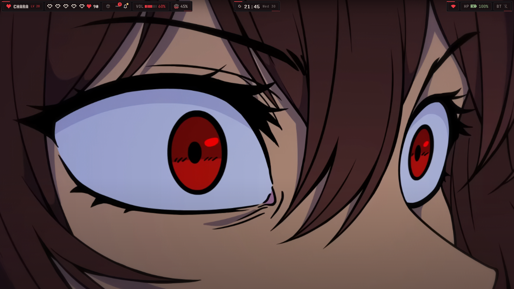
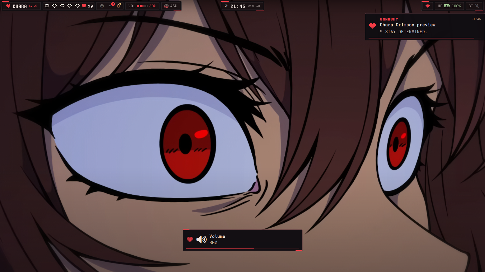
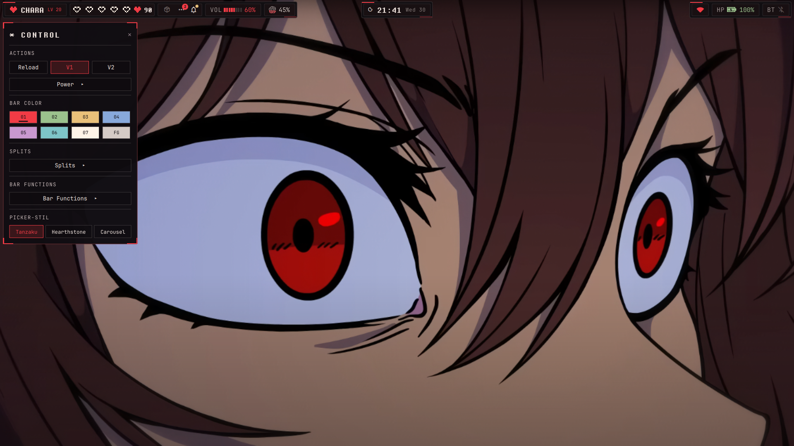
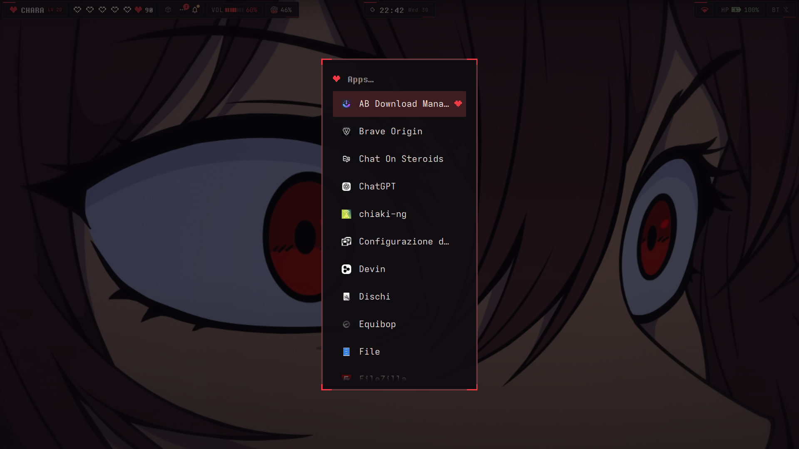
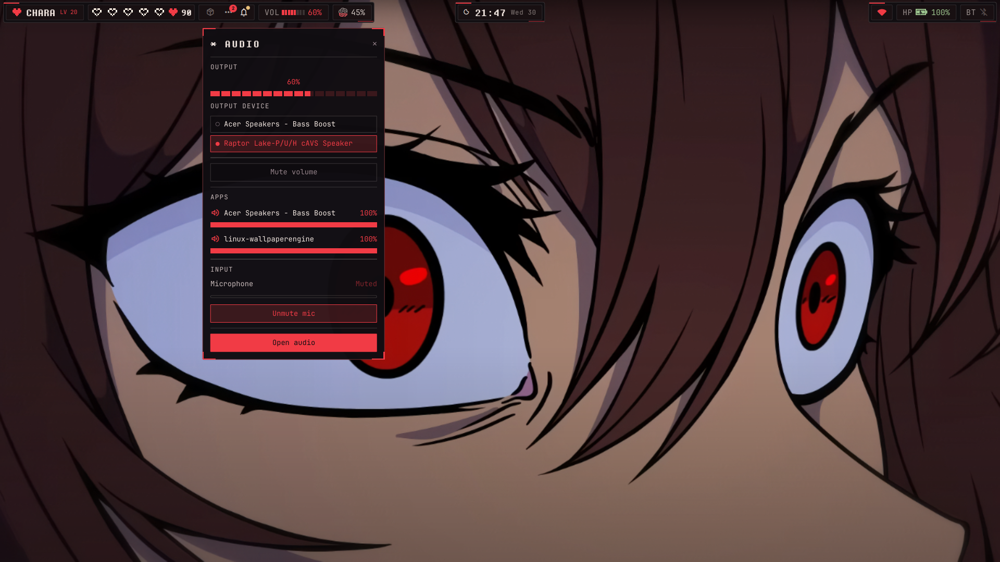
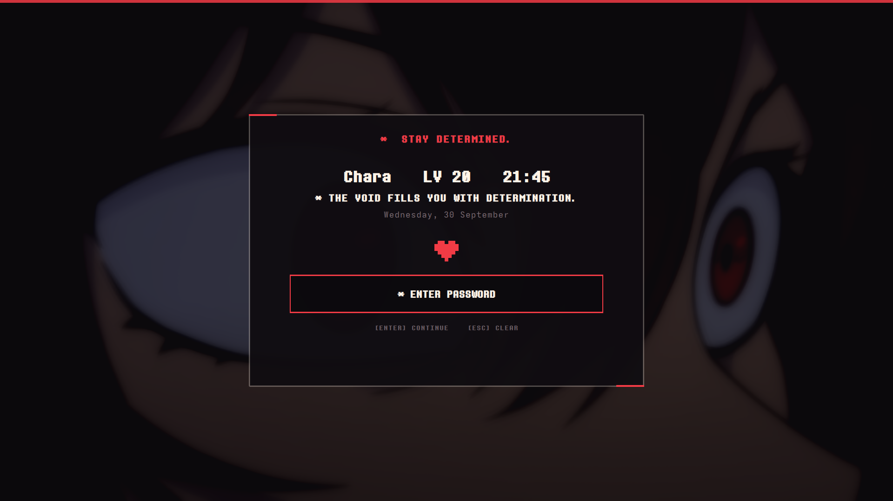
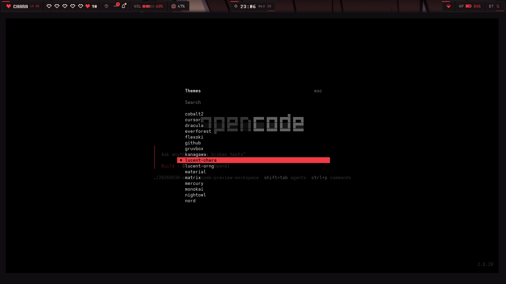

# Chara Determination for Omarchy

A dark Omarchy 4 desktop inspired by Undertale's Chara: near-black surfaces,
garnet `#A45D68` accents, pixel souls, and sharp battle-box frames. Rise V2
provides a compact three-part HUD, with matching menus, popup panels, lock
screen, terminal tools, and an optional red OpenCode theme.

This is the public, portable edition of a real daily-driver configuration. It
contains no passwords, tokens, personal location, device address, package
fingerprint, Steam asset, or original third-party artwork file. The gallery
contains screenshots of the running desktop, credited below.

## Gallery

### Rise desktop



### Notifications and OSD



### Control panel



### Apps menu



### Audio panel



### SAVE lock screen



### OpenCode: lucent-chara



The live scene visible in these screenshots is *Chara's eyes* by Steam
Workshop uploader **f1re** ([Workshop item 3450338231](https://steamcommunity.com/sharedfiles/filedetails/?id=3450338231)).
The Wallpaper Engine asset itself is not included in this repository.

## What is included

- Hyprland layout, animations, bindings, idle integration, and window behavior.
- Rise V2 as the default bar, with five pixel soul workspaces, HP battery
  status, segmented volume, and the compatible V1 variant retained.
- Chara bar, lock screen, notifications, OSD, media, network, power, and
  workspace plugins.
- Mirador workspace overview and Quick Look file preview.
- Chara Determination palette with its matching dark shell surfaces.
- Pixel-framed Rise panels and a Chara menu that uses native application
  discovery, icons, search, and launch behavior.
- Matching Alacritty, Foot, Ghostty, Kitty, btop, and Starship configuration.
- A crimson fastfetch system card with a text soul and local-picture support.
- `lucent-chara`, a dark red copy of OpenCode's `lucent-orng` theme.
- Safe Bluetooth helper and optional self-healing live-wallpaper service.
- Reversible installer and uninstaller with user-state backups.

## Optional Argus system monitor

The public rice does not vendor third-party plugin code or install it silently.
If you want a system-health panel that complements the Chara bar, install
[Argus](https://github.com/diegopluna/omarchy-argus) explicitly:

```bash
omarchy plugin add https://github.com/diegopluna/omarchy-argus.git --enable --yes
omarchy restart shell
```

The visible Rise bar already contains a small garnet eye/`ARG` bridge beside
the network widget; no second Omarchy bar is enabled. Click it for Argus's full
CPU, RAM, temperature, GPU, disk, network, power, history, and opt-in alert
panel. Chara's network, HP battery, and power widgets remain the owners of
those bar controls. Keep alert commands empty unless an outbound notification
hook is intentional; the panel and history remain local by default.

Remove the optional integration with:

```bash
omarchy plugin remove io.github.diegopluna.argus --yes
```

The live integration was checked with Argus `1.2.3` at revision
`0625ce06af4f43b3c504617d0f6ee7268ec6e6a6` on Omarchy `4.0.4-1` and Hyprland
`0.56.2`. It is intentionally separate from the portable installer so a rice
install never fetches or executes external plugin code without an explicit
choice. See [third-party notices](THIRD_PARTY_NOTICES.md) and
[maintenance notes](docs/MAINTENANCE.md).

## Compatibility

- Tested on Omarchy `4.0.0-1`.
- Tested with Hyprland `0.56` and Quickshell `0.3.1`.
- The installer intentionally refuses non-Omarchy-4 systems.
- Nothing writes to `/usr/share/omarchy`.

## Install

Inspect the repository and package lists first, then run:

```bash
git clone https://github.com/cmdr-chara/omarchy-chara-rice.git
cd omarchy-chara-rice
./install.sh --yes --install-packages
```

The installer backs up every overwritten user file under
`~/.local/state/omarchy-chara-rice/backups/`, installs Rise V2, applies the
Chara Determination palette, reloads Hyprland, and restarts the Omarchy shell. It does not
replace the current wallpaper.

Quick Look's D-Bus Space-key bridge and optional Nautilus context-menu file are
registered by the installer and restored or removed by the uninstaller.

Omit `--install-packages` if the packages in `packages/required.txt` are already
present. Optional preview integrations are listed in `packages/optional.txt`.

## Personal settings

### Weather

The public configuration contains no fixed location. Without configuration,
wttr.in may infer an approximate location from the network address. To choose a
location explicitly:

```bash
mkdir -p ~/.config/environment.d
cp examples/environment.conf.example ~/.config/environment.d/90-chara-rice.conf
```

Edit `CHARA_WEATHER_LOCATION`, then sign out and back in.

### Determination font

The font is not redistributed. Download the unchanged Determination Mono file
from the source documented in `THIRD_PARTY_NOTICES.md`, place it at:

```text
~/.local/share/fonts/Determination/DeterminationMonoWeb.ttf
```

Then run `fc-cache -f`. The font supplies the CHARA wordmark, HUD text, and
pixel headings. If it is absent, Qt uses its normal font fallback; body text
continues to use JetBrains Mono.

### Fastfetch picture

Run `chara-fastfetch` for the crimson system card. It uses a text soul by
default. To use an image you own locally, place it at:

```text
~/.config/fastfetch/character-fullbody.png
```

The helper displays that picture through sixel at 26 terminal rows. The
maintainer's original Storyfell Chara portrait is preserved locally and is
not distributed. Installing or uninstalling the rice leaves this local
image untouched.

### OpenCode

The installer adds `lucent-chara` to your custom themes without changing
OpenCode preferences. In OpenCode v2, press `Ctrl+P`, choose **Switch theme**,
and select **lucent-chara** from the full theme list. Choose **Dark** in
Appearance's **Color mode** setting.

The theme duplicates `lucent-orng` from OpenCode `2.0.20`, preserving its dark
surfaces, grayscale text, and remaining status and syntax colors while
replacing the orange accents and menu tints with crimson. The original
`lucent-orng` remains available.

### Live wallpaper

The static wallpaper currently selected by the user is preserved. If
`linux-wallpaperengine` and Wallpaper Engine assets are already installed, the
optional referenced scene can be enabled with:

```bash
./install.sh --yes --install-packages --enable-live-wallpaper
```

Edit `~/.config/chara-rice/live-wallpaper.env` to select a different Workshop
item, monitor, asset directory, or FPS. The monitor defaults to automatic
detection. No Workshop content is stored in this repository.

### HUD preferences and previews

Fresh Rise V2 settings use the compact Chara HUD. Existing Rise widget,
color, and layout preferences remain authoritative. Use its Control panel
to adjust them.

```bash
chara-rice status
chara-rice panel control
chara-rice panel calendar
chara-rice close-panel
chara-rice preview-lock
chara-rice hide-preview
```

Panel shortcuts target the active Rise variant. Lock preview is dismissible and leaves the
normal authentication flow intact.

## Key shortcuts

| Shortcut | Action |
|---|---|
| `Super + E` | Files |
| `Ctrl + Alt + T` | Terminal |
| `Super + Shift + S` | Region screenshot |
| `Super + Shift + O` | Mirador workspace overview |
| `Space` on a selected Nautilus file | Quick Look |
| Media and brightness keys | Chara OSD controls |

## Uninstall and rollback

From the cloned repository:

```bash
./uninstall.sh --yes
```

The uninstaller first creates a safety copy of the currently installed files,
removes only paths listed by the installer, restores overwritten files and the
previous theme/Rise state, then restarts the shell. Packages are never removed
automatically.

## Validation

```bash
./scripts/validate.sh
```

The same checks run on every GitHub push and pull request, including the isolated
installer/uninstaller integration test.

## Credits and license

Original repository work is MIT licensed. Rise, Omarchy-derived components,
Mirador, Quick Look, optional fonts, and artwork references are documented in
`THIRD_PARTY_NOTICES.md`. The gallery reproduces only screenshots of the
configured desktop; original Wallpaper Engine and fan-art files are not
redistributed.

The gallery and panel interactions were verified in the maintainer's native
session. Installer and rollback tests use a temporary home and simulated
system commands; they do not establish compatibility with every hardware or
Omarchy version.

This is an unofficial fan project and is not affiliated with Toby Fox,
Basecamp, or HANCORE Linux.
